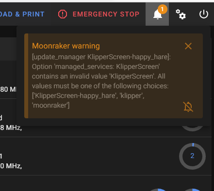

# KlipperScreen

KlipperScreen is a touchscreen GUI that interfaces with [Klipper](https://github.com/kevinOConnor/klipper) via [Moonraker](https://github.com/arksine/moonraker). It can switch between multiple printers to access them from a single location, and it doesn't even need to run on the same host, you can install it on another device and configure the IP address to access the printer.

### Documentation 

[Click here to access the documentation.](https://klipperscreen.readthedocs.io/en/latest/)

### Inspiration
KlipperScreen was inspired by [OctoScreen](https://github.com/Z-Bolt/OctoScreen/) and the need for a touchscreen GUI that
will natively work with [Klipper](https://github.com/kevinOConnor/klipper) and [Moonraker](https://github.com/arksine/moonraker).

[More Screenshots](https://klipperscreen.readthedocs.io/en/latest/Panels/)

 
 
KlipperScreen "Happy Hare" Fork...

# KlipperScreen - ERCF Happy Hare edition

Read more on how [ERCF Panels work...](docs/ERCF.md)

## Introduction
KlipperScreen ERCF Happy Hare edition is quite a mouthful!  It is a forked version of KlipperScreen designed to run/manage ERCF using the Happy Hare driver software.

KlipperScreen is an amazing piece of software but unfortunally lacks the level of panel integration and features I needed for this project.  I hope in the future to have changes integrated so that this becomes a layered install rather than a fork.  Until then you must follow these install directions closely:

## Installation
**Firstly, make sure Happy Hare software is completely up-to-date. Features were added to support this KlipperScreen add on.**

Install and setup a base KlipperScreen from the original source. Get it working. Don't skip this step because I cannot help with basic KlipperScreen and system setup.  Once you have that installed and working, log into you Rasberry Pi and execute the following commands. You can cut'n'paste...

    > cd ~/KlipperScreen
    > git remote set-url origin https://github.com/moggieuk/KlipperScreen-Happy-Hare-Edition.git
    > git pull
   
    > cd ~/KlipperScreen/happy_hare
    > ./install_ks.sh -g <num_gates>
   
(where <num_gates> is the number of selectors you built with, e.g. 9)
   
KlipperScreen will be restarted and hopefully you are now running the enhanced version!

**Notes:**

1: Depending on what you have done with git before on your rpi, the `git pull` operation may require two more steps (you will see in the warning):

    > git config --global user.email "you@example.com"
    > git config --global user.name "First Last"
    > git pull

(CTRL-X out of any editor that pops up -- you can ignore this and the identification doesn't have to be real)

2: The install updates moonraker so that KlipperScreen-happy_hare can be upgraded with update-manager. It comments out the original and inserts Happy Hare specific logic.  The one consequence of this is that you may see the following warning from Moonraker:

This is simply because I didn't want to call my software by the original name "KlipperScreen".  The fix this, click on the bell icon with line through it and select "Never" so the warning never appears again.  Note that the functionality of restarting "KlipperScreen" is still available via Mainsail.

3: If you are installing on a rpi without Klipper and printer attached the install will not be able to find the Klipper "config" directory where the `KlipperScreen.conf` and `ercf_klipperscreen.conf` should be placed.  To fix this, specify a `-c <config_dir>` option to the install line and specify a valid directory where KlipperScreen is expecting to see its config files.

**Expert tip:**
The last step of running './install_ks -g <num_gates>' can be run many times.. if you customize the ERCF part of the KlipperScreen menu and want to make use of the "replicator" function that will automatically replicate menu options for the configured number of gates, you can edit menus.conf and reference the templating there.

Note that the base KlipperScreen is fully up-to-date (and I will continue to pull updates) with changes in the original but also includes extra menu functionality that can be used in the creation of your custom menus.  See the generated ercf_klipperscreen.conf for clues!

## Request
Remember that this is current a Beta release.  I need/want your help in finding corner cases, bugs or ideas for improvement.  I can offer limited help on the Discord channels but I would prefer if you submit an issue report via github so I can manage them.  This project and Happy Hare itself have taken a lot of time. I have a lot more planned so I need your help in organizing my work.

Also, some folks have asked about making a donation to cover the cost of the all the coffee I'm drinking.  I'm not doing this for any financial reward but it you feel inclined a donation to PayPal https://www.paypal.me/moggieuk will certainly be spent making your life with ERCF more enjoyable.

Thank you!

## Caveats
I have only tested on a single screen.  A 640x480 resolution BTT TFT5.0.   I am not a UI programming expert and it is possible that you might find layout problems on other (likely smaller) displays.  Also, I have only tested in and optimized for horizonal orientation.  I doubt it will be effective in vertical but I don't know of any Voron owners with vertically mounted panels. 

*All screen shots are taken with the "Colorize" theme (my preference because the buttons are more defined).  The default is z-bolt and looks slightly different*

## Now go read the [rest of the doc here](docs/ERCF.md)...

