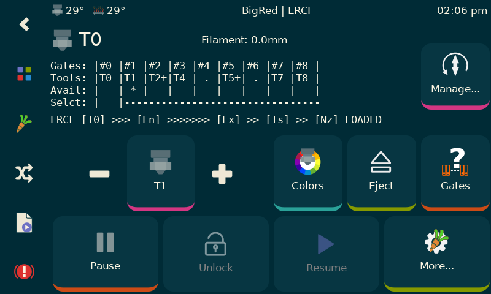

# KlipperScreen

KlipperScreen is a touchscreen GUI that interfaces with [Klipper](https://github.com/kevinOConnor/klipper) via [Moonraker](https://github.com/arksine/moonraker). It can switch between multiple printers to access them from a single location, and it doesn't even need to run on the same host, you can install it on another device and configure the IP address to access the printer.

### Documentation 

[Click here to access the documentation.](https://klipperscreen.readthedocs.io/en/latest/)

### Inspiration
KlipperScreen was inspired by [OctoScreen](https://github.com/Z-Bolt/OctoScreen/) and the need for a touchscreen GUI that
will natively work with [Klipper](https://github.com/kevinOConnor/klipper) and [Moonraker](https://github.com/arksine/moonraker).

[More Screenshots](https://klipperscreen.readthedocs.io/en/latest/Panels/)

 
 
KlipperScreen "Happy Hare" Fork...

# PATIENCE!!  This is not ready yet.  It's live for a couple of beta testers but is unlike to work for you without instruction.  I will release very soon via message on Discord channels..

# KlipperScreen - ERCF Happy Hare edition

## Introduction
KlipperScreen ERCF Happy Hare edition is quite a mouthful!  It is a forked version of KlipperScreen designed to run/manage ERCF using the Happy Hare driver software.

KlipperScreen is an amazing piece of software but unfortunally lacks the level of plugin integration I needed for this project.  I hope in the future to have changes integrated so that this becomes a layered install at most.  Until then you must follow these install directions closely:

## Installation
Install and setup a base KlipperScreen from the original source. Get it working. Don't skip this step because I cannot help with basic KlipperScreen and system setup.  Once you have that installed and working, log into you Rasberry Pi and execute the following commands. You can cut'n'paste...

    > cd ~/KlipperScreen
    > git remote set-url origin https://github.com/moggieuk/KlipperScreen-Happy-Hare-Edition.git
    > git pull
   
    > cd ~/KlipperScreen/happy_hare
    > ./install_ks -g <num_gates>
   
(where <num_gates> is the number of selectors you built with, e.g. 9)
   
KlipperScreen will be restarted and hopefully you are now running the enhanced version!

Expert tip: The last step of running './install_ks -g <num_gates>' can be run many times.. if you customize the ERCF part of the KlipperScreen menu and want to make use of the "replicator" function that will automatically replicate menu options for the configured number of gates, you can edit menus.conf and reference the templating there.

Note that the base KlipperScreen is fully up-to-date (as of March 10th, 2023) with the master but also includes extra menu functionality that can be used in the creation of your custom menus.  See the generated ercf_klipperscreen.conf for clues!

## Request
Remember that this is current a Beta release.  I need/want your help in finding corner cases, bugs or ideas for improvement.  I can offer limited help on the Discord channels but I would prefer if you submit an issue report via github so I can manage them.  This project and Happy Hare itself have taken a lot of time. I have a lot more planned so I need your help in organizing my work.

Also, some folks have asked about making a donation to cover the cost of the all the coffee I'm drinking.  I'm not doing this for any financial reward but it you feel inclined a donation to PayPal https://www.paypal.me/moggieuk will certainly be spent making your life with ERCF more enjoyable.

Thank you!

## Caveats
I have only tested on a single screen.  A 640x480 resolution BTT TFT5.0.   I am not a UI programming expert and it is possible that you might find layout problems on other (likely smaller) displays.  Also, I have only tested in and optimized for horizonal orientation.  I doubt it will be effective in vertical but I don't know of any Voron owners with vertically mounted panels. 

*All screen shots are taken with the "Colorize" theme.  The default is z-bolt and looks slightly different (which I actually prefer)*

Now go read the [rest of the doc here](docs/ERCF.md)...

