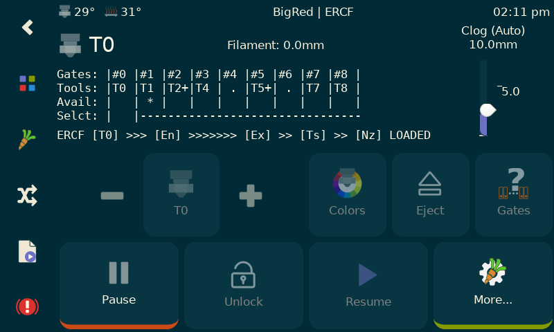
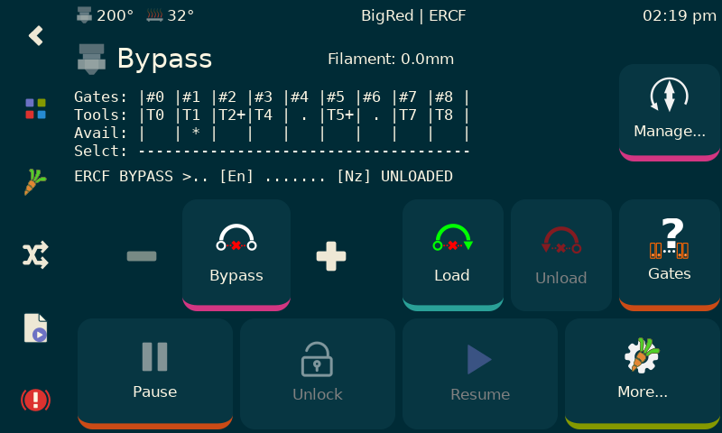
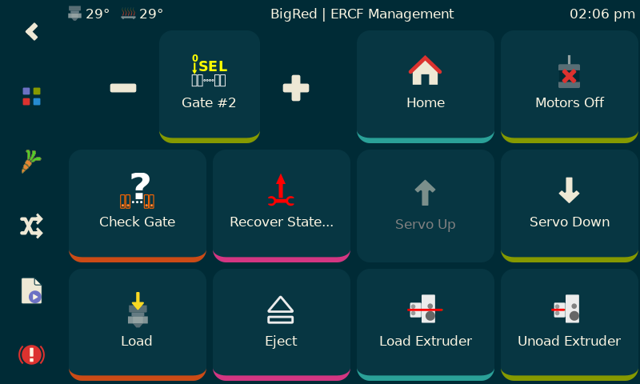
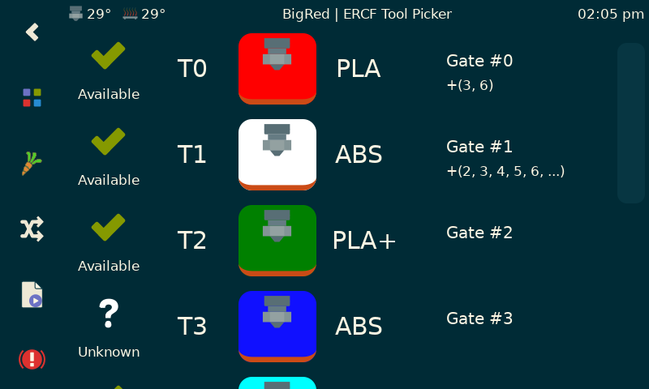
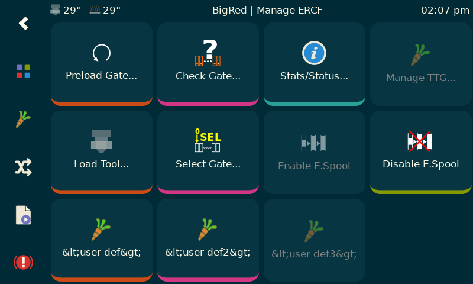
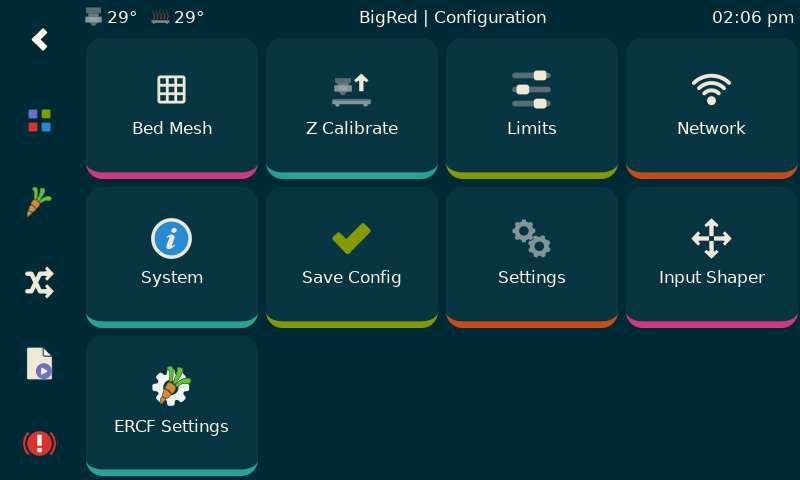
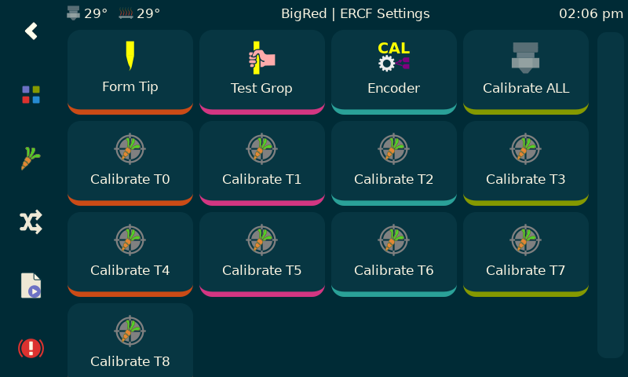

# ERCF

## Introduction
KlipperScreen ERCF Happy Hare edition is quite a mouthful!  It is a forked version of KlipperScreen designed to run/manage ERCF using the Happy Hare driver software.

KlipperScreen is an amazing piece of software but unfortunally lacks the level of plugin integration I needed for this project.  I hope in the future to have changes integrated so that this becomes a layered install at most.  Until then you must follow these install directions closely:

## Installation
Install and setup a base KlipperScreen from the original source. Get it working. Don't skip this step because I cannot help with basic KlipperScreen and system setup.

    > cd ~/KlipperScreen
    > git remote set-url origin https://github.com/moggieuk/KlipperScreen.git
    > ...
   
    > cd ~/KlipperScreen/happy_hare
    > ./install_ks -g <num_gates>
   
(where <num_gates> is the number of selectors you built with, e.g. 9)
   
KlipperScreen will be restarted and hopefully you are now running the enhanced version!

Expert tip: The last step of running './install_ks -g <num_gates>' can be run many times.. if you customize the ERCF part of the KlipperScreen menu and want to make use of the "replicator" function that will automatically replicate menu options for the configured number of gates, you can edit menus.conf and reference the templating there.

Note that the base KlipperScreen is fully up-to-date (as of March 10th, 2023) with the master but includes extra functionality that can be used in the creation of custom menus.  See the generated ercf_klipperscreen.conf for clues!

## Request
Remember that this is current a Beta release.  I need/want your help in finding corner cases, bugs or ideas for improvement.  I can offer limited help on the Discord channels but I would prefer if you submit an issue report via github so I can manage them.  This project and Happy Hare itself have taken a lot of time. I have a lot more planned so I need your help in making my life easier.

Also, some folks have asked about making a donation to cover the cost of the all the coffee I'm drinking.  I'm not doing this for any financial reward but it you feel inclined a donation to PayPal https://www.paypal.me/moggieuk will certainly be spent make your life with ERCF more enjoyable.

Thank you!

*All screen shots are taken with the "Colorize" theme.  The default is z-bolt and looks slightly different*

## Main Panel

## Manage Panel

## Tool Picker Panel

## Recover Panel

## User extensible management panel

## User extensible calibration/test panel

