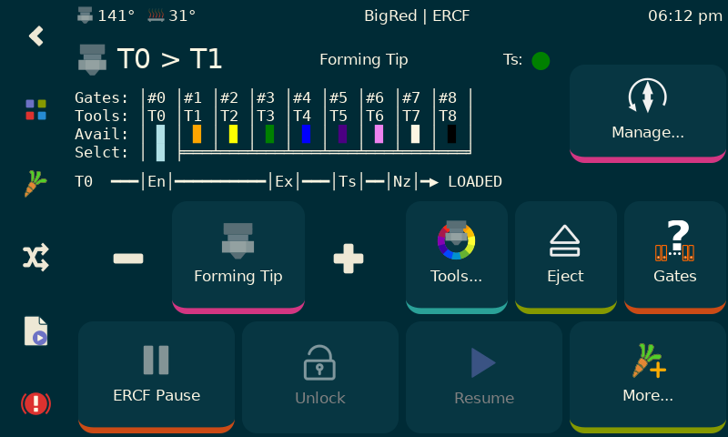
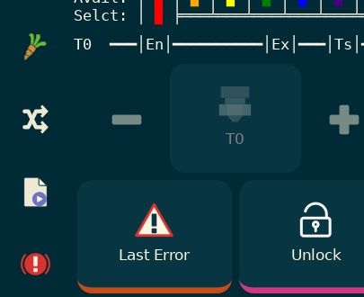
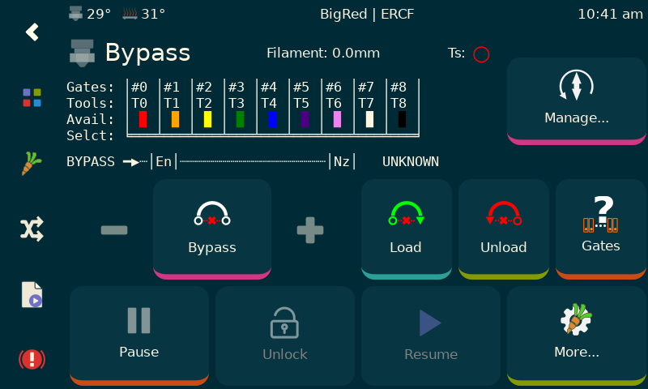
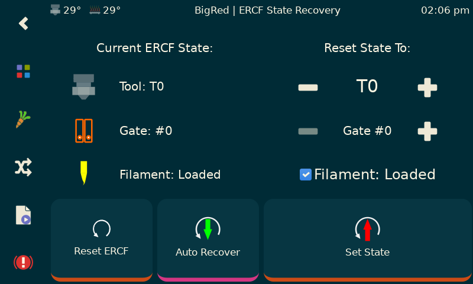
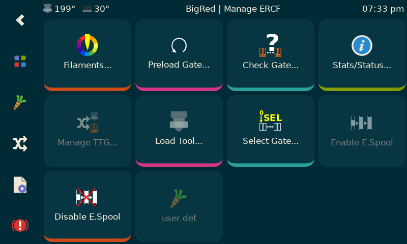
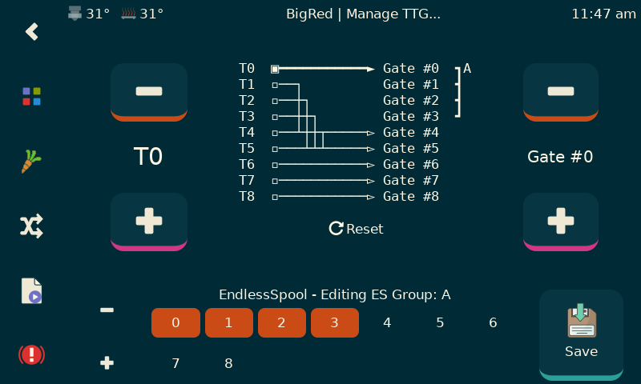
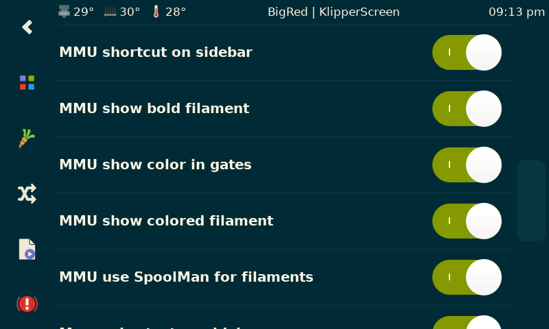

# KlipperScreen Panels for MMU - Happy Hare

## Main Panel

This is the main screen and is accessed by clicking on the little carrot on the left navbar.   Note that you can turn off this carrot in settings in whch case buttons will automatically be added to the KlipperScreen home and print pages.  Personally I think MMU deserves this first class link on the left bar.

The filament color can be displayed as shown here so long as you have your gate map ('gate_material' and 'gate_color' arrays set up either defaults in 'mmu_paramters.cfg' or set with the `MMU_GATE_MAP` command).  If you have toolhead sensor you can conveniently see the state (detected/empty/disabled) near the `Manage...` button

The philosophy behind this screen is that it works with the concept of `Tool` which is really a virtual entity in Happy Hare because of the Tool-To-Gate mapping.  When you are actually printing the panel will look a little different (see below).

There is quite a lot of information compressed onto this page including: (i) tool icon in top left that also indicates if gear stepper is synchronized with the extruder, (ii) toolhead ssensor state (if fitted), (iii) current action being taken, (iv) toolchange in process, etc...

The top left button is replaced with a live monitor of Happy Hare clog/runout detection.  This "thermonitor" usually will sit at the bottom of the scale.  As the difference between extruder and encoder measured movement increases the "temperature" will rise.  If it hits the top a runout condition will be triggered.  The configurable check mark on the side is the 'headroom' used by the automatic tuning option and represents a safe gap to avoid accidental firing.  The detection length (and headroom) are all tunable, but with automatic, they will be updated at least every tool change.

When an MMU error occurs in print the `Pause` button (which can manually force an MMU error/pause condition) will change to `Last Error`.  This will conveniently recall the last error so you don't have to go to the console and well as displaying the tool change that was in progress at the time - very useful before correcting the issue).

If you have a bypass (aka passthrough) installed, and I think they are very useful, then clicking "to the left of" `T0` will bring you to the bypass selector:

When bypass is selected, the `Colors...` button and `Eject` button change to `Load` (Bypass) and `Unload` (Bypass) respectively.  Unloading and selecting a tool will restore the buttons.

Oh, the textual representation mirrors that you see in the Klipper console, but this one dynamically updates!

_Expert Tip: With this new level of visualization I would recommend you put Happy Hare persistence level to the maximum of `4`...  Turn printer on, check KlipperScreen and go... (I almost never home my MMU anymore!)_

## Manage Panel

This screen is accessed by the top right button when not in print (you shouldn't be doing anything here while printing anyway).  Conceptually it is working in the physical space with the concept of Gate (and not Tool).  That distinction is important.   I think most functions are obvious, but the `Load Extruder` and `Unload Extruder` may be new to you.  These do exactly as there names suggest and are designed to help sort out the MMU when it is enraged and you need to do some manual operations.

There is one very important button: `Recover State...`. Since Happy Hare is stateful and will refuse to do things if it doesn't think you should do them, you might need to correct it's state before continuing.

## Recover Panel

This is what the `Recover State...` button reveals.  It shows what Happy Hare thinks the current state is, allows you to manuall reset on the right side of the screen or 'Auto Recover' just the filament LOADED/UNLOADED state.

You can also reset all the persisted state that Happy Hare records across restarts (useful if you are running with persistence level of `4` or have messed with Tool-To-Gate maps, EndlessSpool groups or got completely confused).

One note: If you move the selector on the Manage panel you will change the gate state to another postion. This is physical are real.  Because of TTG mapping the Tool will be reset to 'unknown'.  Why?  Well, because a tool can be mapped to many gates with EndlessSpool.  A gate might not even have a tool mapped to it or it might have more that one tool.

## Tool Picker Panel

This is another way to select a tool.  It makes it clear which gate will be loaded and the filament type and color.

## User extensible management panel

The bottom left `More...` button brings up this panel.  This one is not custom but uses the KlipperScreen menu concept. Therefore it is extensible by users. If included a lot of useful stuff and have replicated some functionality found elsewhere as individual descrete buttons (like load tool or select gate).  Some might prefer this but feel free to comment it out if you don't like duplication.  Also you can use the menu logic that is there as a guide to add you own special macros.

Although this is hooked into KlipperScreen via the menuing system, the top left `Filaments...` button brings up another custom panel for editing the filaments loaded in the gates...

## Filament Editor

This lists the filaments loaded by GATE.  For help it shows the mapping to tool, which will usually be the same, but with tool-to-gate mapping each gate can actually support more than one tool!

The filament color is display together with the filament type.  Click on the `Edit...` button to edit a gate...

Here you can choose filament color by string name or RBG picker.  You can edit the material type but only capital letters A-Z, numbers 0-9, and `+`, `-`, `_` can be used (spaces are not allowed).

Also note that you can update MMU of a filament availability to save running an automatic gate check (although I always recommend that).

## TTG (Tool-to-gate) Map and EndlessSpool Editor

This panel allows for the creation of sophisticated TTG maps and also the definition or editing of EndlessSpool groups.  There is a lot going on on this panel but basically you select the tool you are interested in editing, then you can change teh gate that it maps two (note that multiple tools can point to the same gate).  The "grouping graphic" to the right of the map shows the associated EndlessSpool group and can be managed at the botton of the screen. The lower left `+/-` buttons allow editing of other EndlessSpool groups which are symbolically named with letters A,B,C,...  You can save the entire map you can created with a single push of the `Save` button.  The `Reset` button will default TTG map and EndlessSpool groups to you defined defaults. Finally, you are able to turn the endless spool feature on/off with the little checkbutton next to the EndlessSpool group.

In the example panel shown, tool T0 is selected and maps to Gate #0 and is a member of an EndlessSpool group that combines Gates #0,1,2,3; Tools T2-T5 are all mapped to Gate #5; etc.

## User extensible calibration/test panel

If you really don't like typing on the Klipper console, all the important calibration and test macros can be accessed under `MMU Settings` via the KlipperScreen `Configuration` page.

Here is the set that is included by default.

## Spoolman "filaments" panel

Rather than use the "Filaments" panel, if using Spoolman, you might find this useful (note however that the SpoolID be be edited in the Filaments panel or by Happy Hare with the `MMU_GATE_MAP` command.

## MMU Options

The MMU functionality can be customized with a few settings in the KlipperScreen configuration menu.

    (\_/)
    ( *,*)
    (")_(") MMU Ready
